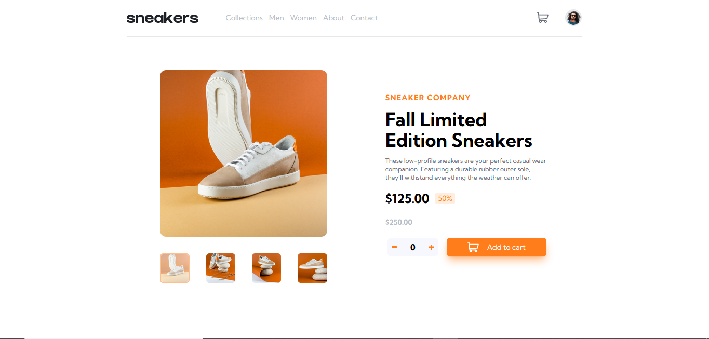

# Frontend Mentor - E-commerce product page solution

This is a solution to the [E-commerce product page challenge on Frontend Mentor](https://www.frontendmentor.io/challenges/ecommerce-product-page-UPsZ9MJp6). Frontend Mentor challenges help you improve your coding skills by building realistic projects.

## Table of contents

- [Overview](#overview)
  - [The challenge](#the-challenge)
  - [Screenshot](#screenshot)
  - [Links](#links)
- [My process](#my-process)
  - [Built with](#built-with)
  - [What I learned](#what-i-learned)
  - [Continued development](#continued-development)
  - [Useful resources](#useful-resources)
- [Author](#author)
- [Acknowledgments](#acknowledgments)

**Note: Delete this note and update the table of contents based on what sections you keep.**

## Overview

### The challenge

Users should be able to:

- View the optimal layout for the site depending on their device's screen size
- See hover states for all interactive elements on the page
- Open a lightbox gallery by clicking on the large product image
- Switch the large product image by clicking on the small thumbnail images
- Add items to the cart
- View the cart and remove items from it

### Screenshot



### Links

- Solution URL: [Ecommerce github repo](https://github.com/Oluwafemi21/sneakers)
- Live Site URL: [Ecommerce](https://oluwafemi21.github.io/sneakers/)

## My process

### Built with

- Semantic HTML5 markup
- CSS custom properties
- Flexbox
- CSS Grid
- Mobile-first workflow
- Tailwindcss Framework

### What I learned

Use this section to recap over some of your major learnings while working through this project. Writing these out and providing code samples of areas you want to highlight is a great way to reinforce your own knowledge.

To see how you can add code snippets, see below:

```js
// Checking if a button is active
thumbBtns.forEach(thumb => {
    thumb.addEventListener('click',()=>{
        thumbBtns.forEach(btn => btn.classList.remove('active-thumbnail'));
        thumb.classList.add('active-thumbnail');
    }
}
```


### Useful resources

- [Tailwind CSS](https://www.tailwindcss.com) - Tailwind Docs. I really like the documentation of the tailwind css framework.

## Author

- Website - [Oluwafemi Olukoya]
- Frontend Mentor - [@Oluwafemi21](https://www.frontendmentor.io/profile/Oluwafemi21)
- Twitter - [@femi_io](https://www.twitter.com/femi_io)

## Acknowledgments

Special thanks to my friends who assisted my javascript implementation KeneNwogu and AjukaDavid.
